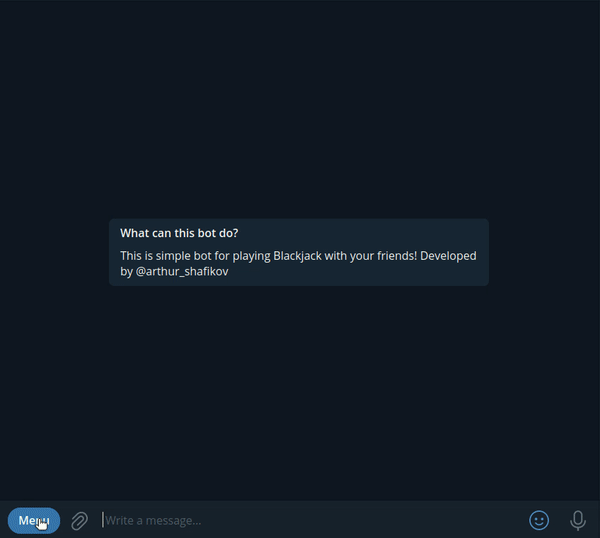
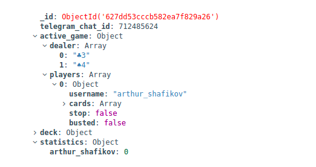

# Telegram Blackjack Bot

Here is the demo of Blackjack bot:


This is a bot with whom you can play Blackjack. This bot can be easily added to group chats and everyone will have an opportunity to play and compete with friends for the best score. In my opinion playing Blackjack with this bot is a cool way to kill your time.

This bot follows all Blackjack rules, expect there's no bets and no "soft 17 rule" (because I think that bot can play better without it). Basically this is 1-1 game with dealer, but it won't be a problem if multiple players join the same game (type /draw command). It doesn't matter how many players are in game, every one of them is playing against dealer.

# Database structure

Under the hood, this project has MongoDB. This database has only one collection - **chats**. **Chat's** document contains _telegram\_chat\_id_, players' _statistics_, current _deck_ and _active\_game_ (storing previous games makes no sense to me) which has only 2 fields - _dealer_ hand and _players'_ hands, and whether _dealer_ has only his cards, _players_ have fields _username_, _stop_ and _busted_. <br>


# Commands

## Docker-compose

Run the application
```
make up
```

Down the application
```
make down
```

---
## Tests

Run unit tests
```
make test
```

---
## Integration Tests

Run integration tests
```
make integration-tests
```
